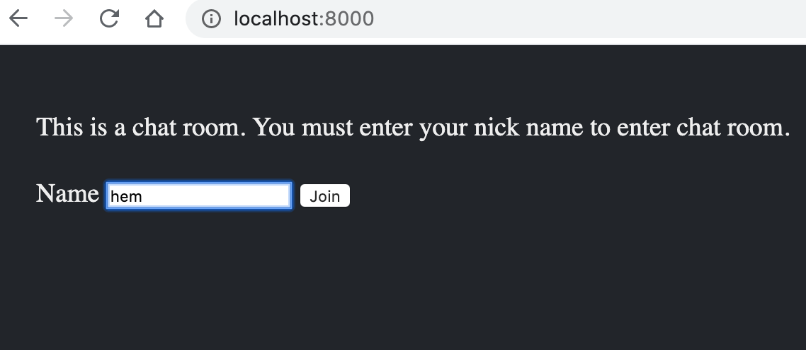
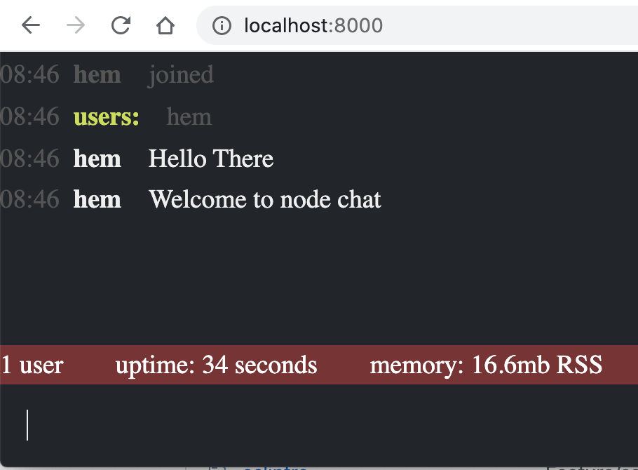

# Basic Node Chat which actually works

## Setup Instructions
- clone the repo `git clone https://github.com/hereshem/Node-Chat` or download [zip](https://github.com/hereshem/Node-Chat/archive/refs/tags/v1.0.0.zip).
- run `node server.js`
- goto browser and type `http://localhost:8000`


## Setup using docker
```
docker run --name chat -itd -p 8000:8000 hereshem/node-chat
```


## Informations
- No any library needed
- Runs on native node.js with version greater than 1.0
- Easy to understand and learn
- Based on long pooling


## Screenshots



